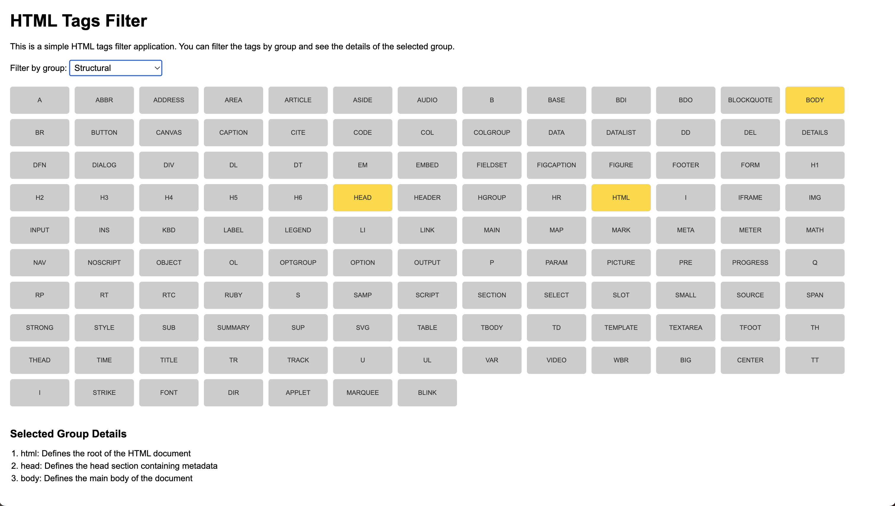

# HTML tags demonstration

This project helps to demonstrate HTML tags.

Tags are split into groups and you can see a specific group by selecting this group in the dropdown list.

## How to run

1. Clone the repository:
2. Launch with `Live Server` in Visual Studio Code.

## Examples

- [HTML tags (for Live Server)](./1_HTML-tags/index.html)
- [Simple Template](./2_TEMPLATE/index.html)
- [Element](./3_ELEMENT/index.html)
- [Element with Image](./4_ELEMENT_WITH_IMAGE/index.html)
- [Element with BEM](./5_ELEMENT_BEM/index.html)
- [SCSS](./6_SCSS_LEVELS/product-card.scss)
- [Style File](./7_STYLE_FILE/index.html)
- [Reset CSS](./8_RESET_CSS/index.html)
- [REM](./9_REM/index.html)
- [EM and Agressive CSS](./10_AGGRESSIVE_EM/index.html)

## License

MIT License

## Author

- [Ilya Zykin](https://github.com/the-teacher)
